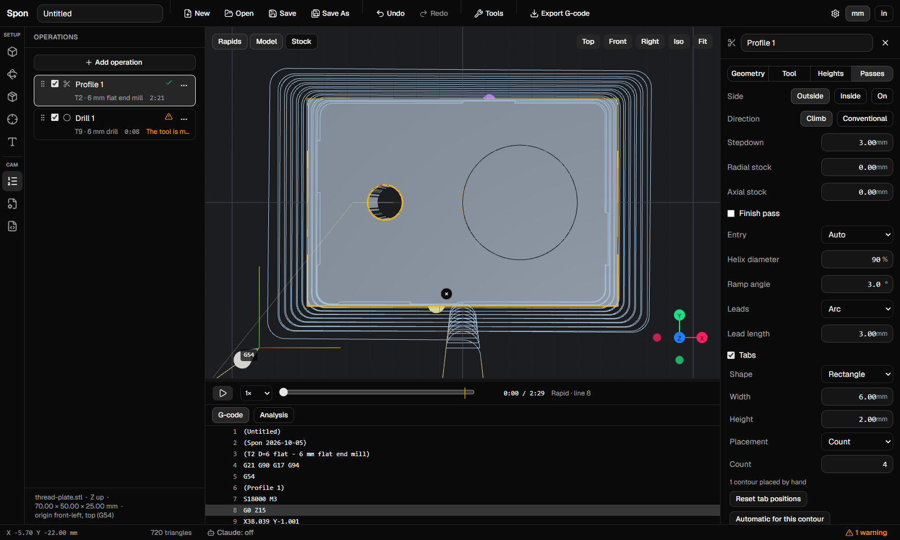
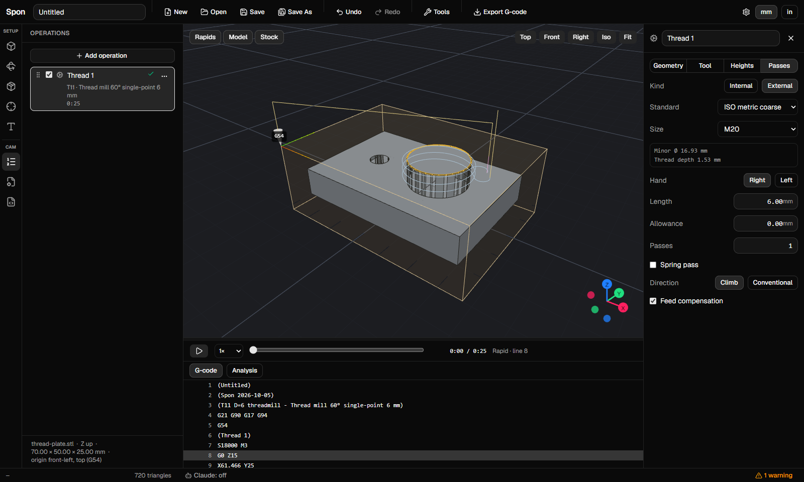
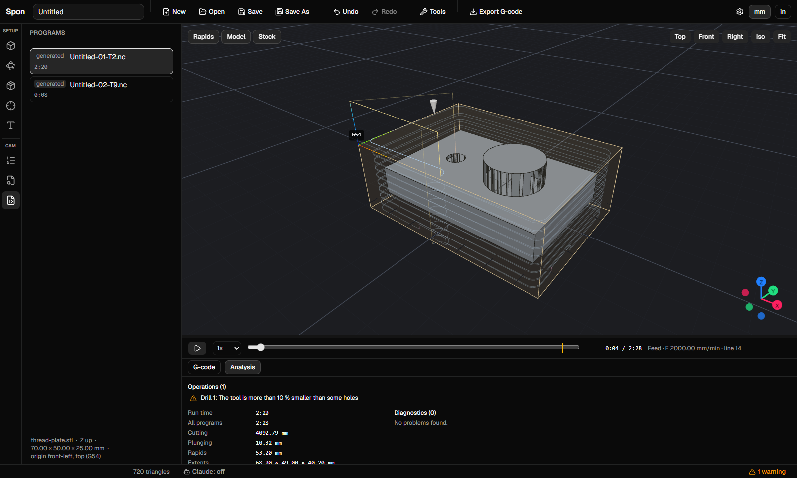

# Spon

Spon is a browser-based CAM tool for 2.5D CNC machining. You import a model or drawing, set up stock and work offset, add profile, pocket and drill operations, check the toolpaths in 3D, and export G-code for your machine. It runs entirely in the browser: files stay on your computer, and jobs are saved as `.spon` files.

An MCP server lets Claude (or any MCP client) drive the same jobs: on `.spon` files from the terminal, or in the open browser tab.



## Features

**Workspace**
- A left icon rail with Setup (Model, Orientation, Stock, Origin) and CAM (Operations, Post, Programs). One panel is open at a time; it can be resized, or hidden by clicking its icon again. Status dots show what needs attention, and a setup summary sits under the CAM panels.
- Operation rows show the first problem, reorder by dragging, and have a ⋯ menu and shortcuts that act while the Operations panel is open (Ctrl+D duplicates, Del deletes, Alt+↑/↓ moves). Machine settings are in the top bar.

**Import**
- STL meshes, STEP and IGES solids (multi-body files ask which body; faces the reader cannot mesh are retried coarser, or reported as missing), DXF drawings and SVG drawings.
- SVG files from Inkscape, Illustrator, Affinity, CAD exports and web artwork. Shapes are layered by Inkscape layer or by colour. Pixel-based files ask for a scale: 96 dpi, 72 dpi or a target width.
- Files without units ask for millimetres or inches.

**Setup**
- Orient the model by quarter turns, by laying a face flat, or by spinning it about Z.
- Auto or fixed stock, and a work coordinate system (G54–G59) anchored to the corners, edges or centre of the stock, with an offset.
- With no model, set the stock size yourself: a spoilboard or blank can be faced without importing anything.
- Machine profiles (rapid speeds, acceleration, maximum feed) for cycle-time estimates and feed checks, and how far a through cut may go into the spoilboard (0.5 mm by default) before the G-code check calls it an error.

**Operations**
- **Profile** outside, inside or on a contour.
  - Open lines can be cut on the line, or to its left or right, with a Reverse toggle.
  - Climb or conventional milling, stepdowns, radial and axial stock, and a finish pass.
  - Ramp, helix or plunge entry; arc or line leads.
  - Tabs on closed and open contours (see Tabs below).
- **Pocket** with islands, stepover, and wall and floor finishing; unmachined areas are shown. Tabs on a through pocket are bridges that leave each island joined to the wall (or the next island), so the islands stay in place.
- **Tabs** keep a through cut from freeing the part, on profile (closed and open lines), slot and pocket (bridges to islands).
  - Shape, width, height, and a count or a spacing. Automatic tabs prefer straight edges, stay clear of corners and balance around the part.
  - Edit them in the viewport: click a toolpath to add a tab, click a tab to select it, drag to move it, Del or × removes it, Esc deselects. A contour you edit turns manual (drawn in a second colour); "Automatic for this contour" and "Reset tab positions" in the inspector undo that.
  - Tabs that do not fit, a bridge that would be too long and a bridge that would end on its own island (across the mouth of a C-shaped island) are reported as warnings.
- **Drill**: plain drilling, dwell, peck and chip-break cycles, with a diameter filter.
- **Face** the whole stock or picked areas, zig-zag or spiral, with overlap, stepdown and a finish pass.
- **Chamfer** an edge or contour with a chamfer mill or V-bit, countersink a hole, or cut an open line to its left or right. You give the chamfer width, and Spon computes the depth from the tool's tip angle. A deburr button sets a small edge break.
- **Slot** along drawn lines and arcs, or recognised in models.
  - Tool-width, wider and trochoidal slots along drawn lines and arcs.
  - Straight and arc slots found in STL, STEP and IGES models, closed or open, blind or through.
  - Square ends cut inside, to the wall, or with dogbones, as you choose.
  - Tabs across the slot, placed along its centreline; trochoidal loops at a tab are left out.
- **Engraving and V-carve** from drawings and flat faces of models.
  - Engrave lines and outlines by depth, or by V-bit line width.
  - V-carve closed outlines with the depth following the width and sharp corners.
  - A max depth with a linked clearing operation for wide letters.
- **Thread milling:** internal and external straight threads (ISO metric, UNC/UNF or custom), single-point and multi-tooth thread mills, all hand/climb combinations, with cutter and hole checks.
- **Text:** typed text in bundled or uploaded fonts (outline and single-line), on the stock or a model face, with multi-line, spacing, fit, arc, rotation and mirror; V-carve, engrave, pocket or profile it.
- **Inlays:** Make inlay… turns a V-carve into an inlay pocket and writes a matching plug job (mirrored, V-carve plug + clearing) with inlay depth, start depth and glue gap; the toolpaths are computed so the plug fits the pocket, and the V-bit also cleans the floor corners and narrow gaps the clearing tool can't reach.
- **Gouge check.** Toolpaths are checked against the model (chamfer depth and the facets of round walls are allowed for). A cut into it is an error that keeps the toolpath, shows red markers in the viewport and blocks export.
- Geometry is picked in the viewport, or from a catalog of faces, edge loops, holes and drawing contours.



**Tools**
- A tool library in the browser, starting from a set of starter tools.
- Imports Spon libraries, Fusion 360 libraries (`.json` / `.tools`) and LinuxCNC tool tables (`tool.tbl`). For a tool table, the T numbers are kept and the tool types are guessed from the comments.

**G-code**
- Post-processors for GRBL / grblHAL / FluidNC, LinuxCNC / Mach, and Fanuc / Haas, with one file per tool if wanted.
- Generated programs are played back, timed and analysed in the viewport, together with any G-code you import.
- Export refuses on errors. Warnings ask for confirmation.



**Claude integration (MCP)**
- `packages/mcp` is a local stdio MCP server with tools for jobs, import, setup, geometry, operations (profile, pocket, drill, face, chamfer and thread; tabs included, with `generate` listing each operation's tabs per contour), round holes and bosses with handles, a `list_threads` table, generation, a PNG preview, export and the tool library.
- **Live mode.** Click **Claude** in the app's status bar, and Claude drives the job open in that tab. Each change is one undo step.
- See [`packages/mcp/README.md`](packages/mcp/README.md).

## Getting started

Requirements: Node.js 22 or newer, and pnpm 9 (`corepack enable` gives you the pinned version).

```sh
pnpm install
pnpm dev          # the app on http://localhost:5173
```

To use the MCP server with Claude Code:

```sh
pnpm mcp:build
claude mcp add spon -- node <path-to-repo>/packages/mcp/dist/spon-mcp.js
```

## Repository layout

| Package | What it is |
|---|---|
| `packages/core` (`@sponcam/core`) | Framework-free TypeScript: units, geometry, importers (STL, DXF, SVG, STEP/IGES via an injected reader), the job model and commands, CAM operations, post-processors, G-code parsing and analysis, preview rendering, and `.spon` file IO. |
| `packages/web` (`@sponcam/web`) | The app: Vite, React and react-three-fiber, with a Comlink worker for imports and CAM. |
| `packages/mcp` (`@sponcam/mcp`) | The MCP server (Node, stdio) and the live WebSocket bridge to the app. |
| `docs/superpowers/specs`, `docs/superpowers/plans` | Design specs and implementation plans for each milestone. |

## Development

| Goal | Command |
|---|---|
| All unit tests | `pnpm test` |
| Typecheck everything | `pnpm typecheck` |
| Build the app | `pnpm build` |
| End-to-end tests (Playwright, its own port) | `pnpm e2e` (first time: `pnpm --filter @sponcam/web exec playwright install chromium`) |
| One package | `pnpm --filter @sponcam/core test` (or `web` / `mcp`) |
| Build the MCP server | `pnpm mcp:build` |

Rules worth knowing before you change anything:
- `@sponcam/core` must not import React, three.js, the DOM or Node APIs.
- Stored lengths are mm.
- Job edits go through the commands in `core/src/job`, so undo works.

More detail is in [`.claude/skills/spon-dev/SKILL.md`](.claude/skills/spon-dev/SKILL.md).

## Status and roadmap

| Milestone | Contents | Status |
|---|---|---|
| 1 | Import (STL, DXF), orientation, stock, WCS, `.spon` jobs | Done |
| 2 | G-code toolkit: parse, play back, time and analyse programs | Done |
| 3 | 2D/2.5D CAM: profile, pocket, drill, tool library, post-processors | Done |
| 3.2 | STEP and IGES import | Done |
| 3.5 | MCP API: headless server and live bridge to the browser tab | Done |
| 4.1 | SVG import, LinuxCNC tool tables, open-line profile sides | Done |
| 4.2 | Facing, chamfer and the gouge check | Done |
| 4.3 | Slots | Done |
| 4.3a | Left-panel rethink | Done |
| 4.4 | Engraving and V-carve | Done |
| 4.4b | Text in Spon | Done |
| 4.4c | V-carve inlays | Done |
| 4.5 | Thread milling | Done |
| 4.5b | Tapered pipe threads | Next |
| 4.6 | Automatic operation suggestions | Planned |

Later: adaptive clearing, rest machining, cutter-compensation output, material-removal simulation, Heidenhain and Siemens dialects, and 3D operations.

## License

Spon is released under the [MIT License](LICENSE). Third-party components keep their own licences; see [THIRD_PARTY_NOTICES.md](THIRD_PARTY_NOTICES.md).
